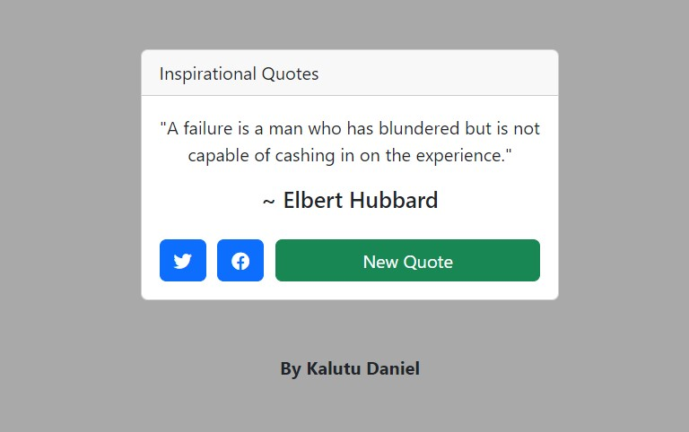

# Random Quote Machine
This is a simple React application that displays inspirational quotes. Each time you click the "New Quote" button, a random quote will be fetched from the [type.fit](https://type.fit) API and displayed on the screen. The background color of the app also changes with each new quote.

## Preview

## Features
- Generates and displays random quotes.
- Allows users to fetch new quotes with a button click.
- Provides social media sharing options for Twitter and Facebook.
- Uses React.js and Bootstrap for front-end development.
- Utilizes font awesome for icons.
- User-friendly interface.
- Responsive design for mobile and desktop devices.

## Installation
1. Clone the repository: `git clone https://github.com/Kalutu/Random-Quote-Machine`
2. Navigate to the project directory: `cd random-quote-machine`
3. Install dependencies: `npm install`

## Usage
1. Start the development server: `npm start`
2. Open a web browser and go to `http://localhost:3000` to view the application.

## Project Structure
The main component of the application is the `App` component defined in the `src/index.js` file. It contains the logic for fetching quotes, managing state, and rendering the UI.

The component structure is as follows:
- `App`: The main component that handles the state and rendering of the application.
- `quotes`: State variable that stores the fetched quotes from the API.
- `randomQuote`: State variable that stores the currently displayed random quote.
- `color`: State variable that stores the background color of the application.
- `useEffect`: Hook used to fetch quotes from the API and initialize the state.
- `getNewQuote`: Function that generates a new random quote and updates the state.
- `UI elements`: HTML elements and React components that render the quote, author, and buttons.

## Dependencies
- React: JavaScript library for building user interfaces.
- ReactDOM: React package for working with the DOM.
- Babel: JavaScript compiler for using modern JavaScript features.
- Bootstrap: CSS framework for responsive design.
- Font Awesome: Library of icons for web projects.

## Contributing
Contributions are welcome! If you encounter any issues or have suggestions for improvements, please feel free to open an issue or submit a pull request.

## Credits
This Random Quote Machine project is part of the [FreeCodeCamp Frontend Certification](https://www.freecodecamp.org/learn/front-end-libraries/) course. It was completed as one of the required projects in the curriculum.

FreeCodeCamp (FCC) is a nonprofit organization that offers a comprehensive web development curriculum and certifications. The Frontend Certification focuses on frontend libraries and frameworks like React, and it covers various topics including HTML, CSS, JavaScript, and more.

Learn more about FreeCodeCamp and their educational programs on their official website: [https://www.freecodecamp.org/](https://www.freecodecamp.org/)

